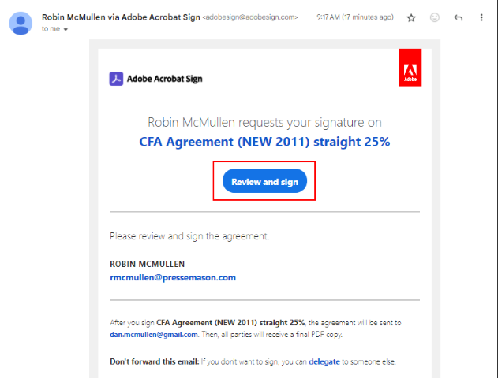
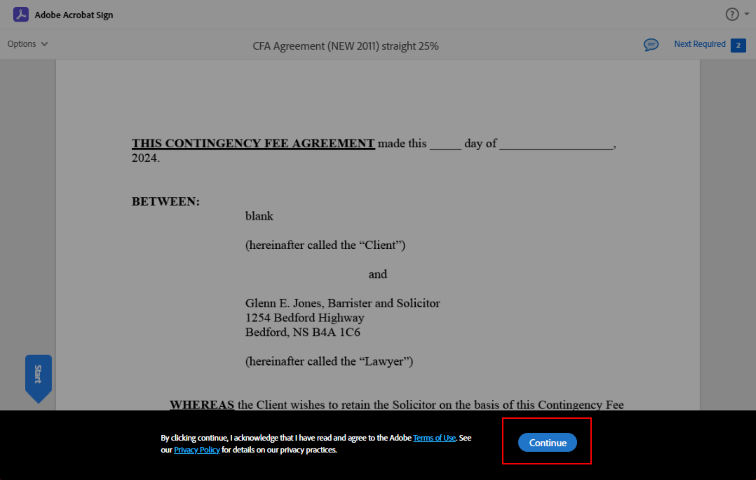
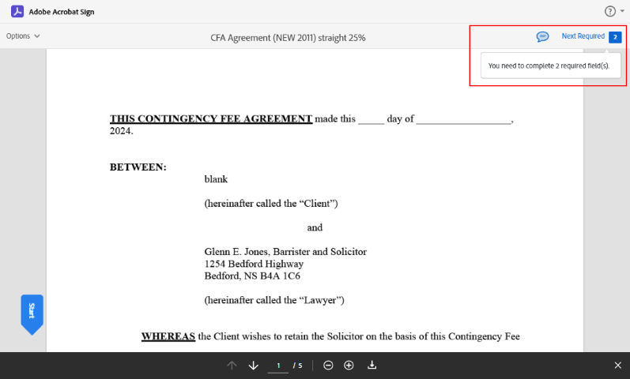
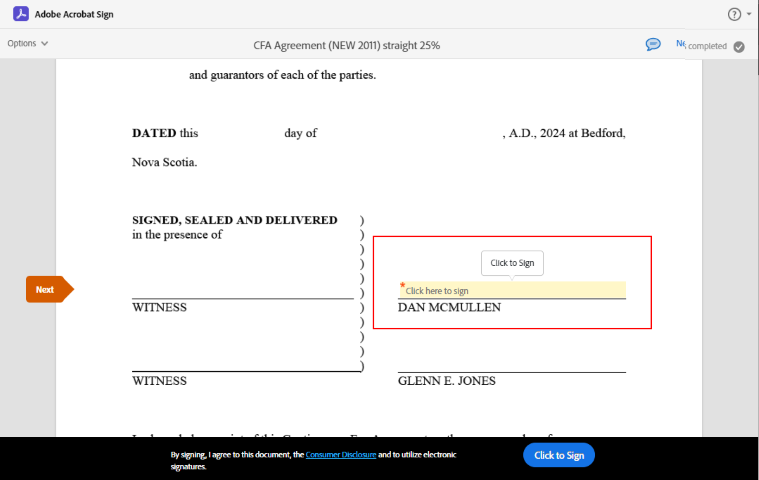
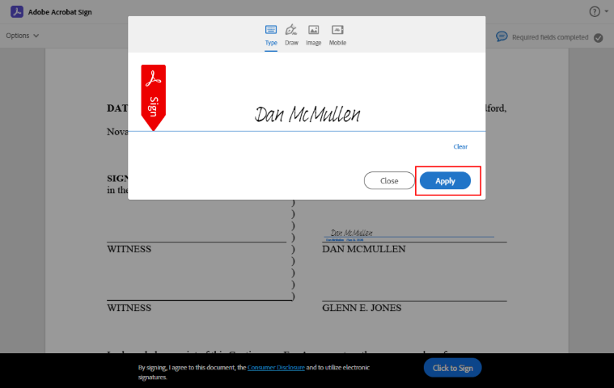
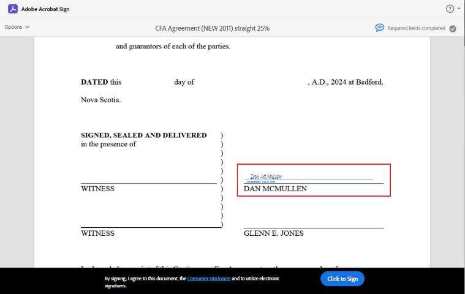
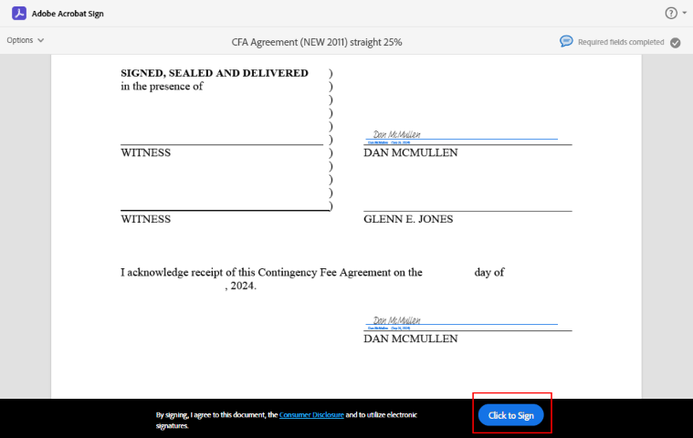
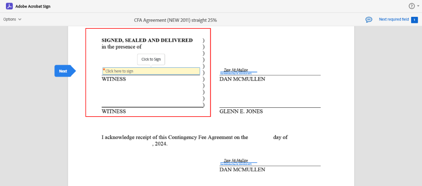
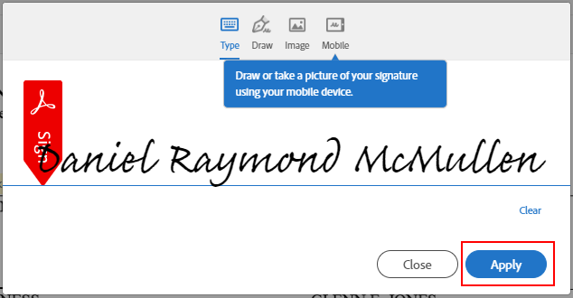
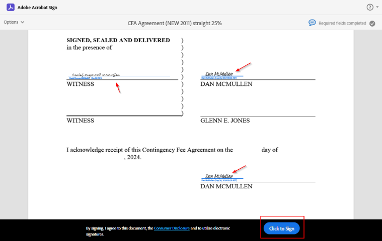

## Adobe Acrobat Sign  

#### First Email received  
Click **Review and sign**  

  

Click **Continue** to agree to Terms and Conditions  

Click in **Next Required**  

> NOTE: there are 2 fields for initial signer  

  

Click **Click here to sign** in the yellow field to start the signing process  

  

Your name is auto populated but can be typed or drawn

> On Mobile the option to draw your signature is the default  

Click **Apply** to continue 

  

Your "signature" after clicking Apply  

  

Once both signature fields are complete click **Click to Sign**  

  

#### Second Email Received  

Click **Review and sign**  

All steps will be the same, but only one signature is required  

Click **Continue** to agree to Terms and Conditions followed by  **Next Required Field**  

Click **Click here to sign** in the yellow field to sign as the Witness  

  

> NOTE the witness name is auto populated  

  

All three signature fields now show as completed  
Click **Click to Sign** to complete the process  

  
