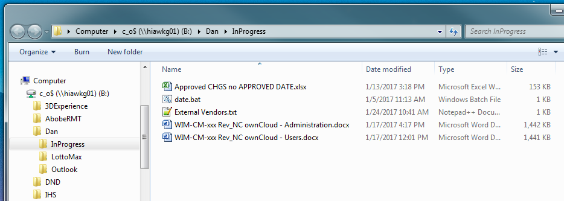
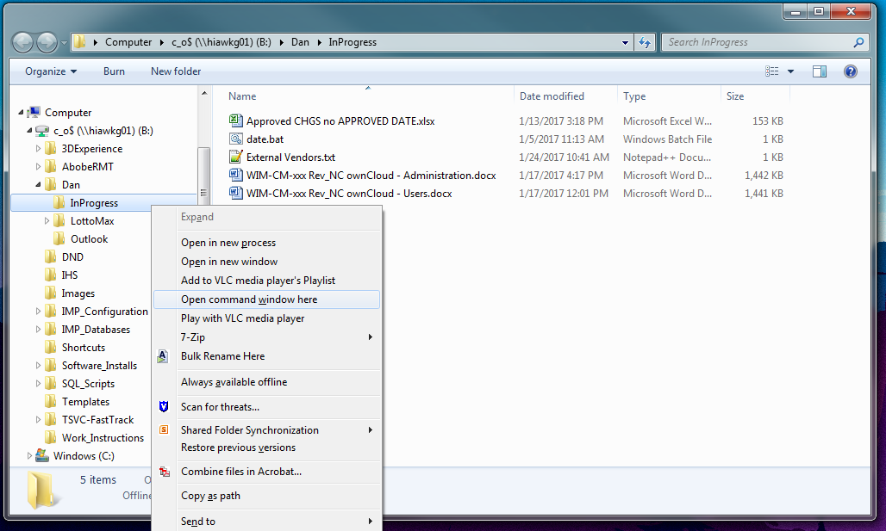
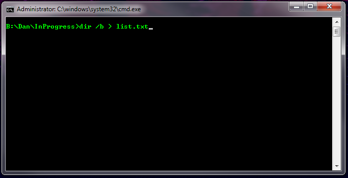
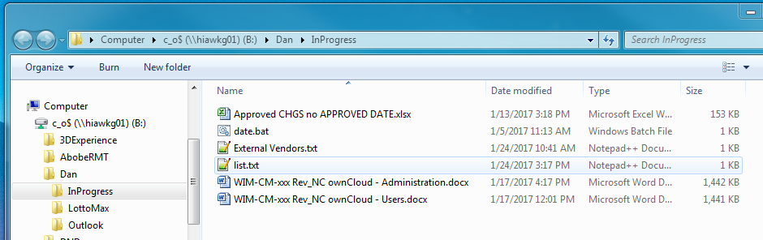
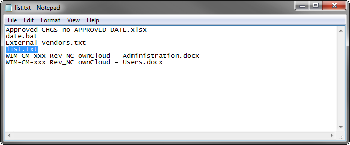

## How to create a text listing of files in a specified directory 

Open the directory you need the file list from in Windows Explorer. In this example we are using the directory _InProgress_. 


Hold the **_shift_** key and right click on the folder containing the required files. Click on **Open command window here**. 


Open the command window opens type: 
``` batch
dir /b > list.txt
```
and press enter. 


This will add a file called **list.txt** to your originally selected folder. 


Open the **list.txt** file by double clicking on it, find **list.txt** in the list and delete it. 


You are now able to rename the text file to some thing more appropriate. It may also be copied into a Word document or converted to a PDF for delivery. 

Updated 25-January-2017
