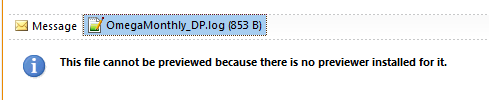
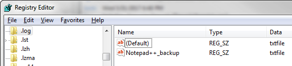
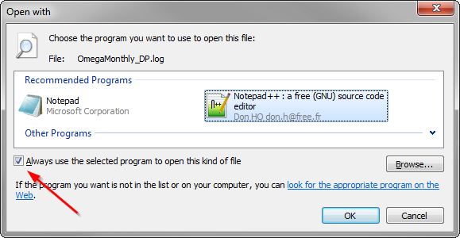
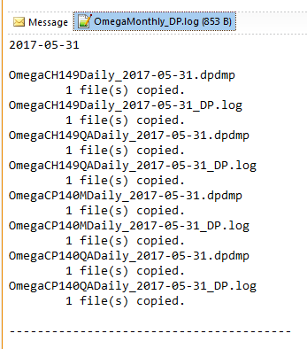
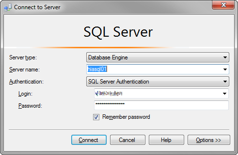

#  General - Tips  <!--Top navigation Anchor-->  
 
  
[Outlook Preview Error](#outlook-preview-error)  
[Miscrosoft SQL Server Management Studio Remembered Logins](#miscrosoft-sql-server-management-studio-remembered-logins)  

- - -  

#### Outlook Preview Error  
[&uarr;](#top)  

This will allow `.log` files to be previewed by Outlook when Notepad++ is your default text editor.  

  

Check `HKEY_CLASSES_ROOT\.log` registry key's (Default) value. It has to be `txtfile` not `Notepad++_file`.  

  

Once the entry above is confirmed you may need to make Notepad++ the default program again.  

In Windows Explorer right-click any `.log` file and select "Open With..." -> Choose Default Program. Select Windows Notepad++ and make sure that you have the "default" check set.  

  

Restart Outlook, now it will to show you `.log` files.  

  

- - -  

#### Miscrosoft SQL Server Management Studio Remembered Logins  
[&uarr;](#top)  

Miscrosoft SQL Server Management Studio 2016 remembers the logins and passwords, if **Remember password** has been selected.  

  

To delete these remebered logins you will need to delete the `SqlStudio.bin` file from the following location:  

`C:\Users\%username%\AppData\Roaming\Microsoft\SQL Server Management Studio\13.0\`  

- Replace `%username%` with your Windows login  
- The number `13.0` may be different dependinf on the Version installed  
- Microsoft SQL Server Management Studio must be closed when deleting the file  

> AppData is a hidden folder. You may need to show hidden folders in explorer if you try to navigate to this directory  

 - - -  

###### ---  

- [&uarr;](#top)  
- <a href="javascript:javascript:history.go(-1)">Back</a> 
- [Home](../../ConfigurationNotes.html) 

<!-- [&larr;](../../ConfigurationNotes.html#general)  [&uarr;](#top) [&#8962;](../../ConfigurationNotes.html)-->
