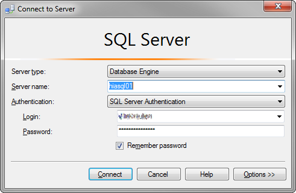

#### Miscrosoft SQL Server Management Studio Remembered Logins  
[&uarr;](#top)  

Miscrosoft SQL Server Management Studio 2016 remembers the logins and passwords, if **Remember password** has been selected.  

  

To delete these remebered logins you will need to delete the `SqlStudio.bin` file from the following location:  

`C:\Users\%username%\AppData\Roaming\Microsoft\SQL Server Management Studio\13.0\`  

- Replace `%username%` with your Windows login  
- The number `13.0` may be different dependinf on the Version installed  
- Microsoft SQL Server Management Studio must be closed when deleting the file  

> AppData is a hidden folder. You may need to show hidden folders in explorer if you try to navigate to this directory  

 ###### ---  

- [&uarr;](#top)  
- <a href="javascript:javascript:history.go(-1)">Back</a> 
- [Home](https://danmcmullen.github.io) 

